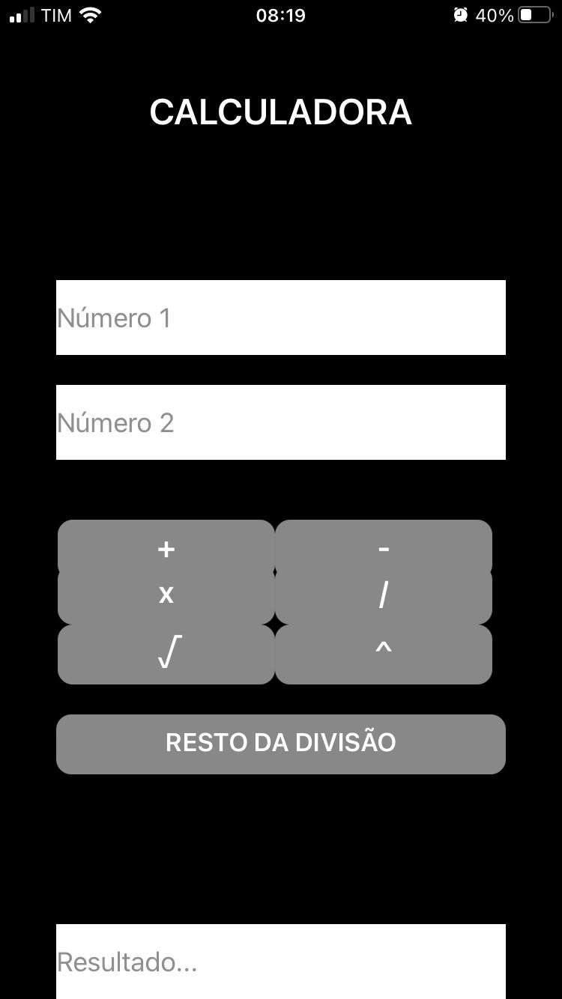
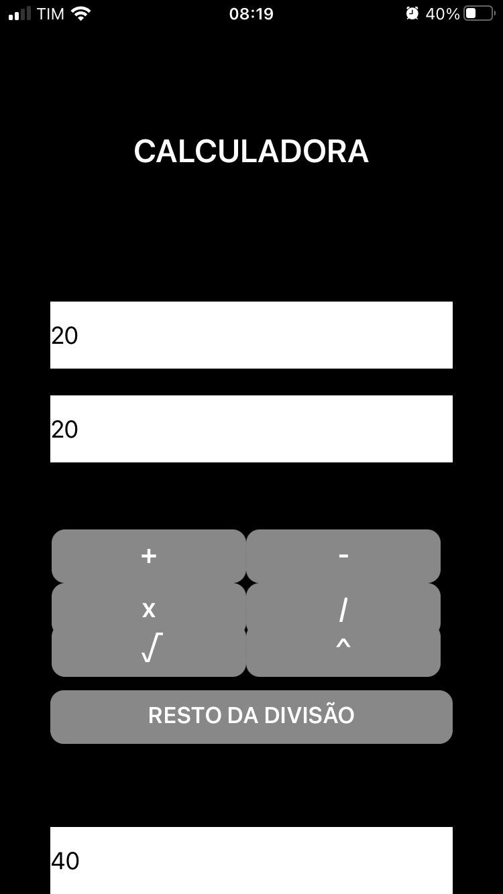

# Aplicativo de calculadora simples

## Visão geral

O Simple Calculator App é um aplicativo básico, mas poderoso, desenvolvido usando o MIT App Inventor. Este aplicativo permite aos usuários realizar operações aritméticas essenciais, como adição, subtração, multiplicação e divisão. A interface intuitiva garante que os usuários possam realizar cálculos de forma rápida e fácil em seus dispositivos Android.

## Características

- **Operações aritméticas básicas**: Suporta adição, subtração, multiplicação e divisão.
- **Entrada do usuário**: permite que os usuários insiram dois números para os cálculos.
- **Cálculo instantâneo**: Fornece resultados imediatos para os números inseridos.
- **Botão Limpar**: permite que os usuários redefinam os campos de entrada e iniciem um novo cálculo.
- **Interface Simples**: Projetado com uma interface simples e fácil de usar, adequada para todas as faixas etárias.

## Ferramentas de desenvolvimento

- **MIT App Inventor**: um ambiente de desenvolvimento integrado baseado na Web para a criação de aplicativos Android.
- **Componentes usados**:
   - **TextBox**: Para entrada do usuário (números).
   - **Botões**: Para realizar operações aritméticas e limpar a entrada.
   - **Rótulo**: Para exibir o resultado.

## Como usar

1. Abra o aplicativo Calculadora Simples em seu dispositivo Android.
2. Insira o primeiro número no primeiro campo de entrada.
3. Insira o segundo número no segundo campo de entrada.
4. Pressione o botão correspondente à operação desejada (Adicionar, Subtrair, Multiplicar, Dividir).
5. O resultado será exibido abaixo dos botões.
6. Pressione o botão “Limpar” para redefinir os campos de entrada e realizar um novo cálculo.

## Capturas de tela do aplicativo

   
   

## Instalação

1. Baixe o arquivo APK do aplicativo Calculadora Simples.
2. Transfira o arquivo APK para o seu dispositivo Android.
3. Abra o arquivo APK e siga as instruções na tela para instalar o aplicativo.

## Melhorias Futuras

- **Funções avançadas**: adicione suporte para funções matemáticas mais avançadas, como exponenciação, raízes quadradas e funções trigonométricas.
- **Histórico**: Implemente um recurso para armazenar e exibir o histórico de cálculos.
- **Suporte multilíngue**: suporte para vários idiomas para atingir um público mais amplo.

## Licença

Este projeto está licenciado sob a licença MIT - consulte o arquivo [LICENSE](LICENSE) para obter detalhes.

## Reconhecimentos

- Obrigado aos desenvolvedores do MIT App Inventor por fornecerem uma plataforma acessível para desenvolver aplicativos Android.
- Inspiração de vários recursos on-line e tutoriais sobre a construção de aplicativos de calculadora.

## Contato

Para qualquer dúvida ou sugestão, entre em contato:

- **E-mail**: gustavorodrigues11cr@gmail.com
- **GitHub**: [gustavosousa07]((https://github.com/gustavosousa07))

---

Obrigado por usar o aplicativo Calculadora Simples! Seu feedback é valioso para nós.
